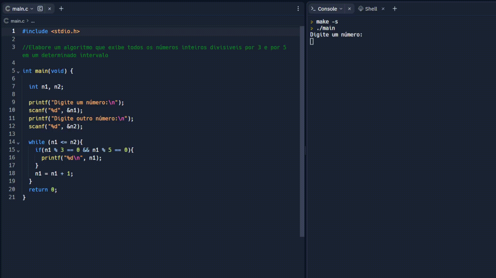

# Divisíveis no intervalo de dois números 🔴
Este projeto mostra os números divísiveis por 3 e 5 no intervalo entre eles, pede dois números, mostra o resultado(divísiveis no intervalo por 3 e 5). No código foi utilizado a linguagem C. 

## ⚡ Linguagem usada

 
 

 
 
 

## 💻 Reflexão

- Estudo da linguagem C, um código bem simples que abrange variáveis, estrutura condicionais e estrutura de repetição.

- Skills da linguagem: estrutura de repetição(While), estrutura condicionais(if) printf, scanf e variável int.

 
 

## 📸 Minhas redes

